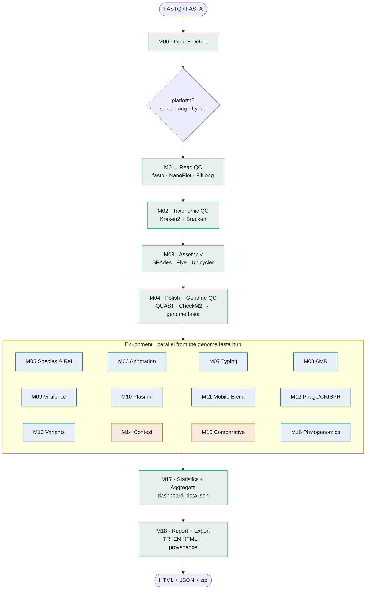

# BacForge

A modular, end-to-end analysis platform for prokaryotic (bacterial) whole-genome sequencing (WGS).

[](https://www.python.org/)
[](docs/pipeline_architecture.html)
[](#roadmap)

[Türkçe](README.md) · English

---

BacForge auto-detects ONT / Illumina / hybrid inputs **without asking the user to choose** and processes them
from raw reads to a final report with a single command. It picks its tools by platform: SPAdes for short reads,
Flye + Medaka polishing for long reads, Unicycler for hybrid. Once an assembly (`genome.fasta`) is produced,
the species/reference identification, annotation, strain typing, AMR, virulence, plasmid, mobile-element,
phage/CRISPR, variant, comparative and phylogenomic modules run in parallel; results are gathered into a single
bilingual (TR+EN) HTML report. The short, long and hybrid paths have been validated end to end on real
*Acinetobacter baumannii* data.

BacForge follows the same architectural pattern as VirusForge (virus/phage) and Vaxforge, but is a separate,
isolated installation.

## Pipeline

Shape: **branch → merge → fan → merge → report**. The platform decision (`short·long·hybrid`) only picks the
tools at `M01`/`M03` and merges at the `M04 genome.fasta` hub; from there independent enrichment modules fan out,
are gathered at `M17` and rejoin in the `M18` report. Interactive bilingual diagram (the full DAG, extracted
from the real `run()` dependencies): [`docs/pipeline_architecture.html`](docs/pipeline_architecture.html).



## Modules

M00–M04 are the backbone; the platform only swaps tools here. M05–M16 are parallel enrichment from the
`genome.fasta` hub; a module that does not apply (e.g. pangenome on a single sample) honestly returns
`NOT_APPLICABLE`.

| Code | Module | Tool(s) | Input ← |
|:---:|---|---|---|
| M00 | Input & Detect | read type / `data_type` detection | raw input |
| M01 | Read QC | fastp (short) · NanoPlot + Filtlong (long) | M00 |
| M02 | Taxonomic QC | Kraken2 + Bracken → species | M01 |
| M03 | Assembly | SPAdes · Flye + Medaka · Unicycler | M01 |
| M04 | Polish & Genome QC · **HUB** | QUAST · CheckM2 → `genome.fasta` | M03 |
| M05 | Species & Reference | barrnap · blastn · NCBI datasets · FastANI | M04 · M02 |
| M06 | Annotation | Bakta + reference-ordered genome map | M04 · M05 |
| M07 | Strain Typing | mlst · Kleborate / ECTyper / SISTR | M04 · M02/M05 |
| M08 | AMR | AMRFinderPlus | M04 |
| M09 | Virulence | ABRicate (VFDB) | M04 |
| M10 | Plasmid | MOB-suite | M04 |
| M11 | Mobile Genetic Elem. | ISEScan | M04 |
| M12 | Phage/CRISPR/Defense | geNomad | M04 |
| M13 | Variants | Snippy (+ Bakta reference) | M04 · M05 |
| M14 | Genomic Context | clinker (AMR/virulence synteny) | M06 · M05 · M08 · M09 |
| M15 | Comparative | Panaroo *(≥2 samples)* | M04 |
| M16 | Phylogenomics | Mash + NJ tree | M04 · M05 |
| M17 | Statistics & Aggregate | aggregator → `dashboard_data.json` | M02·M04·M05·M07–M13 |
| M18 | Report & Export | TR+EN HTML · zip · provenance | M17 (+ M01·M06·M14·M16 figures) |

## Installation

```bash
git clone https://github.com/aliarslan47/BacForge.git
cd BacForge

conda env create -f environment.yml
conda activate bacforge
pip install -e .

# Isolated tool environments + databases (CheckM2, Kraken2, Bakta, geNomad ...)
bash setup/setup_envs.sh
```

Portability: copy the project folder and set the `BACFORGE_HOME/_DB/_WORK` environment variables. Details:
[`docs/04_PORTABILITY.md`](docs/04_PORTABILITY.md).

## Usage

```bash
# Detected resources / paths
python3 -m bacforge.cli info

# Platform detection from input (no conda required)
python3 -m bacforge.cli detect --input <file|dir>

# Run the pipeline end to end (resume by default; --no-resume to start fresh)
python3 -m bacforge.cli run --input <file|dir>

# Web dashboard (FastAPI, default :8000)
python3 -m bacforge.cli server --port 8000

# Output: runs/<time>_<label>/  → M18.../report.html + PROJECT_COMPLETE.zip
```

## Example: *Acinetobacter baumannii* (short read)

Real ENA data (`DRR035591`, Illumina MiSeq ~125×). Every module with real output; statuses are honest.

| Analysis | Result |
|---|---|
| Species (Kraken2 + Bracken) | *A. baumannii* (94.83%) |
| Assembly (QUAST) | 4.05 Mb · N50 104 kb |
| Genome quality (CheckM2) | completeness 100% |
| Closest reference (FastANI) | ATCC 17978 · ANI 97.67% |
| Strain typing (mlst) | ST571 (Pasteur) |
| AMR (AMRFinderPlus) | 15 genes — **blaOXA-66, armA, blaADC-82, sul1** … |

The long-read (ONT, ST641, CheckM2 99.88%, blaOXA-23/armA) and hybrid (Unicycler, CheckM2 100%/0.08%) paths
were also validated end to end on the same strain.

## Tool registry

Each tool's official repository is verified; versions are detected at runtime. Selection rationale (APA + DOI +
PMID): [`docs/literature/`](docs/literature/).

| Tool | Role |
|---|---|
| [fastp](https://github.com/OpenGene/fastp) · [NanoPlot](https://github.com/wdecoster/NanoPlot) · [Filtlong](https://github.com/rrwick/Filtlong) | Read QC & preprocessing |
| [Kraken2](https://github.com/DerrickWood/kraken2) + [Bracken](https://github.com/jenniferlu717/Bracken) | Taxonomic QC |
| [SPAdes](https://github.com/ablab/spades) · [Flye](https://github.com/fenderglass/Flye) + [Medaka](https://github.com/nanoporetech/medaka) · [Unicycler](https://github.com/rrwick/Unicycler) | Assembly (short/long/hybrid) |
| [QUAST](https://github.com/ablab/quast) · [CheckM2](https://github.com/chklovski/CheckM2) | Assembly quality & completeness |
| [FastANI](https://github.com/ParBLiSS/FastANI) · [NCBI datasets](https://github.com/ncbi/datasets) | Species & closest reference |
| [Bakta](https://github.com/oschwengers/bakta) | Genome annotation |
| [mlst](https://github.com/tseemann/mlst) · [Kleborate](https://github.com/klebgenomics/Kleborate) | Strain typing |
| [AMRFinderPlus](https://github.com/ncbi/amr) · [ABRicate](https://github.com/tseemann/abricate) (VFDB) | AMR & virulence |
| [MOB-suite](https://github.com/phac-nml/mob-suite) · [ISEScan](https://github.com/xiezhq/ISEScan) · [geNomad](https://github.com/apcamargo/genomad) | Plasmid · mobile elem. · phage/CRISPR |
| [Snippy](https://github.com/tseemann/snippy) · [Mash](https://github.com/marbl/Mash) · [Panaroo](https://github.com/gtonkinhill/panaroo) · [clinker](https://github.com/gamcil/clinker) | Variant · phylogenomics · comparative |

## Roadmap

- [x] **Milestone 1** — reliable end-to-end core; **short + long + hybrid** validated on *A. baumannii* data
- [x] Chemistry-aware ONT polishing (R9/R10 → Flye mode + Medaka model)
- [x] M05/M16 relatedness accuracy (accession-based dedup, per-contig FASTA)
- [ ] **Milestone 2** — multi-tool enrichment: RGI/ResFinder, PlasmidFinder, IntegronFinder, Kaptive/chewBBACA, batch M14/15/16
- [ ] Content-aware routing via geNomad (bacterial / phage branch)

## Repository layout

```
bacforge/     Python package (config · resources · runner · detect · modules · orchestrator · cli · web)
config/       central YAML config (no absolute paths)
docs/         architecture + I/O flow + literature + pipeline_architecture.html
databases/    databases (BACFORGE_DB)  [git-ignored]
runs/         time-stamped runs (BACFORGE_WORK)  [git-ignored]
samples/      input samples  [git-ignored]
setup/        environment & database setup scripts
```

## Principles

- **Isolation:** separate package, isolated conda environments, no cross-imports.
- **Honesty:** `WARNING` when a value is missing, `NOT_APPLICABLE` when it does not apply; no hard-coded or fabricated results — no PASS without tool exit 0 and real output.
- **Traceability:** input → tool + version → database + version → command → output chain (provenance).

## License

Forge family: **BacForge** (bacteria) · [VirusForge](https://github.com/aliarslan47/VirusForge) (virus/phage) · Vaxforge.
