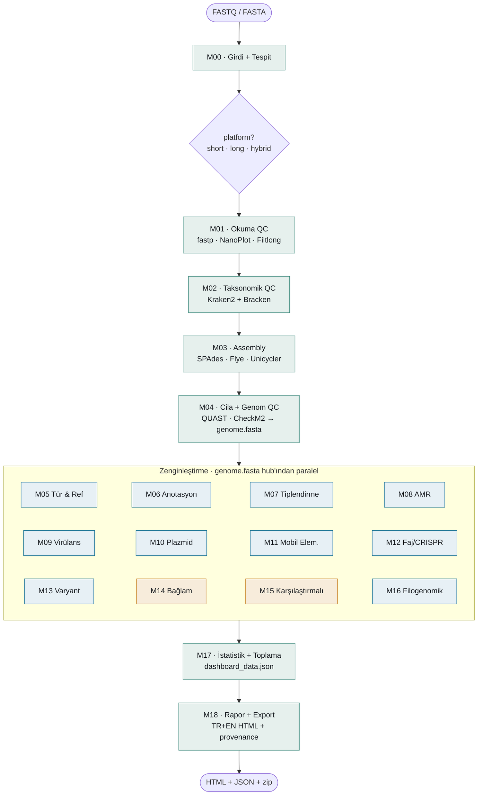

# BacForge

Prokaryotik (bakteriyel) tam genom dizileme (WGS) için modüler, uçtan uca bir analiz platformu.

[](https://www.python.org/)
[](https://aliarslan47.github.io/BacForge/pipeline_architecture.html)
[](#yol-haritas%C4%B1)

Türkçe · [English](README.en.md)

---

BacForge, ONT / Illumina / hibrit girdileri **kullanıcıdan seçim istemeden** otomatik tanır ve ham okumadan
nihai rapora kadar tek komutla işler. Platform tipine göre araçlarını kendi içinde seçer: kısa okuma için
SPAdes, uzun okuma için Flye + Medaka cilalama, hibrit için Unicycler. Bir montaj (`genome.fasta`) elde
edildikten sonra tür/referans kimliği, anotasyon, suş tiplendirme, AMR, virülans, plazmid, mobil elementler,
faj/CRISPR, varyant, karşılaştırmalı ve filogenomik modülleri paralel çalışır; sonuçlar tek bir çift-dilli
(TR+EN) HTML raporda toplanır. Kısa, uzun ve hibrit yollar *Acinetobacter baumannii* gerçek verisiyle uçtan
uca doğrulanmıştır.

BacForge, VirusForge (virüs/faj) ve Vaxforge ile aynı mimari deseni izler; ayrı ve izole bir kurulumdur.

## Pipeline

Şema: **dallan → birleş → yelpaze → birleş → rapor**. Platform kararı (`short·long·hybrid`) yalnızca `M01`/`M03`
araçlarını seçer ve `M04 genome.fasta` hub'ında birleşir; buradan bağımsız zenginleştirme modülleri yelpaze
gibi açılır, `M17`'de toplanıp `M18` raporunda birleşir. Etkileşimli çift-dilli şema (gerçek `run()`
bağımlılıklarından çıkarılmış tam DAG): [**render edilmiş şema**](https://aliarslan47.github.io/BacForge/pipeline_architecture.html) · kaynak: `docs/pipeline_architecture.html`.



## Modüller

M00–M04 omurga; platform yalnızca burada araç değiştirir. M05–M16 `genome.fasta` hub'ından paralel zenginleştirme;
uygun olmayan modül (ör. tek örnekte pangenom) dürüstçe `NOT_APPLICABLE` döner.

| Kod | Modül | Araç(lar) | Girdi ← |
|:---:|---|---|---|
| M00 | Girdi & Tespit | okuma tipi / `data_type` tespiti | ham girdi |
| M01 | Okuma QC | fastp (short) · NanoPlot + Filtlong (long) | M00 |
| M02 | Taksonomik QC | Kraken2 + Bracken → tür | M01 |
| M03 | Assembly | SPAdes · Flye + Medaka · Unicycler | M01 |
| M04 | Cila & Genom QC · **HUB** | QUAST · CheckM2 → `genome.fasta` | M03 |
| M05 | Tür & Referans | barrnap · blastn · NCBI datasets · FastANI | M04 · M02 |
| M06 | Anotasyon | Bakta + referans-sıralı genom haritası | M04 · M05 |
| M07 | Suş Tiplendirme | mlst · Kleborate / ECTyper / SISTR | M04 · M02/M05 |
| M08 | AMR | AMRFinderPlus | M04 |
| M09 | Virülans | ABRicate (VFDB) | M04 |
| M10 | Plazmid | MOB-suite | M04 |
| M11 | Mobil Genetik Elem. | ISEScan | M04 |
| M12 | Faj/CRISPR/Savunma | geNomad | M04 |
| M13 | Varyant | Snippy (+ Bakta referans) | M04 · M05 |
| M14 | Genomik Bağlam | clinker (AMR/virülans sinteni) | M06 · M05 · M08 · M09 |
| M15 | Karşılaştırmalı | Panaroo *(≥2 örnek)* | M04 |
| M16 | Filogenomik | Mash + NJ ağaç | M04 · M05 |
| M17 | İstatistik & Toplama | toplayıcı → `dashboard_data.json` | M02·M04·M05·M07–M13 |
| M18 | Rapor & Export | TR+EN HTML · zip · provenance | M17 (+ M01·M06·M14·M16 görselleri) |

## Kurulum

```bash
git clone https://github.com/aliarslan47/BacForge.git
cd BacForge

conda env create -f environment.yml
conda activate bacforge
pip install -e .

# İzole araç ortamları + veritabanları (CheckM2, Kraken2, Bakta, geNomad ...)
bash setup/setup_envs.sh
```

Taşınabilirlik: proje klasörünü kopyala, `BACFORGE_HOME/_DB/_WORK` ortam değişkenlerini ayarla. Detay:
[`docs/04_PORTABILITY.md`](docs/04_PORTABILITY.md).

## Kullanım

```bash
# Tespit edilen kaynaklar / yollar
python3 -m bacforge.cli info

# Girdiden platform tespiti (conda gerektirmez)
python3 -m bacforge.cli detect --input <dosya|dizin>

# Pipeline'ı uçtan uca çalıştır (resume varsayılan; --no-resume ile baştan)
python3 -m bacforge.cli run --input <dosya|dizin>

# Web dashboard (FastAPI, vars. :8000)
python3 -m bacforge.cli server --port 8000

# Çıktı: runs/<zaman>_<etiket>/  → M18.../report.html + PROJECT_COMPLETE.zip
```

## Örnek: *Acinetobacter baumannii* (kısa okuma)

Gerçek ENA verisi (`DRR035591`, Illumina MiSeq ~125x). Tüm modüller gerçek çıktıyla; durumlar dürüst.

| Analiz | Sonuç |
|---|---|
| Tür (Kraken2 + Bracken) | *A. baumannii* (%94.83) |
| Assembly (QUAST) | 4.05 Mb · N50 104 kb |
| Genom kalitesi (CheckM2) | completeness %100 |
| En yakın referans (FastANI) | ATCC 17978 · ANI %97.67 |
| Suş tiplendirme (mlst) | ST571 (Pasteur) |
| AMR (AMRFinderPlus) | 15 gen — **blaOXA-66, armA, blaADC-82, sul1** … |

Uzun okuma (ONT, ST641, CheckM2 %99.88, blaOXA-23/armA) ve hibrit (Unicycler, CheckM2 %100/%0.08) yolları
da aynı suşta uçtan uca doğrulandı.

## Araç kaydı

Her aracın resmî deposu doğrulandı; sürümler çalışma anında tespit edilir. Seçim gerekçeleri (APA + DOI + PMID):
[`docs/literature/`](docs/literature/).

| Araç | Rol |
|---|---|
| [fastp](https://github.com/OpenGene/fastp) · [NanoPlot](https://github.com/wdecoster/NanoPlot) · [Filtlong](https://github.com/rrwick/Filtlong) | Okuma QC & ön-işleme |
| [Kraken2](https://github.com/DerrickWood/kraken2) + [Bracken](https://github.com/jenniferlu717/Bracken) | Taksonomik QC |
| [SPAdes](https://github.com/ablab/spades) · [Flye](https://github.com/fenderglass/Flye) + [Medaka](https://github.com/nanoporetech/medaka) · [Unicycler](https://github.com/rrwick/Unicycler) | Assembly (short/long/hybrid) |
| [QUAST](https://github.com/ablab/quast) · [CheckM2](https://github.com/chklovski/CheckM2) | Montaj kalitesi & tamlık |
| [FastANI](https://github.com/ParBLiSS/FastANI) · [NCBI datasets](https://github.com/ncbi/datasets) | Tür & en yakın referans |
| [Bakta](https://github.com/oschwengers/bakta) | Genom anotasyonu |
| [mlst](https://github.com/tseemann/mlst) · [Kleborate](https://github.com/klebgenomics/Kleborate) | Suş tiplendirme |
| [AMRFinderPlus](https://github.com/ncbi/amr) · [ABRicate](https://github.com/tseemann/abricate) (VFDB) | AMR & virülans |
| [MOB-suite](https://github.com/phac-nml/mob-suite) · [ISEScan](https://github.com/xiezhq/ISEScan) · [geNomad](https://github.com/apcamargo/genomad) | Plazmid · mobil elem. · faj/CRISPR |
| [Snippy](https://github.com/tseemann/snippy) · [Mash](https://github.com/marbl/Mash) · [Panaroo](https://github.com/gtonkinhill/panaroo) · [clinker](https://github.com/gamcil/clinker) | Varyant · filogenomik · karşılaştırmalı |

## Yol haritası

- [x] **Milestone 1** — güvenilir uçtan-uca çekirdek; **short + long + hybrid** *A. baumannii* verisiyle doğrulandı
- [x] Kimya-otomatik ONT cilalama (R9/R10 → Flye modu + Medaka modeli)
- [x] M05/M16 akrabalık doğruluğu (accession-bazlı dedup, per-contig FASTA)
- [ ] **Milestone 2** — çok-araçlı zenginleştirme: RGI/ResFinder, PlasmidFinder, IntegronFinder, Kaptive/chewBBACA, batch M14/15/16
- [ ] geNomad ile içerik-farkında yönlendirme (bakteri / faj kolu)

## Depo yapısı

```
bacforge/     Python paketi (config · resources · runner · detect · modules · orchestrator · cli · web)
config/       merkezi YAML config (mutlak yol yok)
docs/         mimari + I/O akışı + literatür + pipeline_architecture.html
databases/    veritabanları (BACFORGE_DB)  [git dışı]
runs/         zaman-damgalı koşular (BACFORGE_WORK)  [git dışı]
samples/      girdi örnekleri  [git dışı]
setup/        ortam & veritabanı kurulum scriptleri
```

## İlkeler

- **İzolasyon:** ayrı paket, izole conda ortamları, çapraz-import yok.
- **Dürüstlük:** değer yoksa `WARNING`, uygun değilse `NOT_APPLICABLE`; sabit veya uydurma sonuç yok — araç exit 0 + gerçek çıktı yoksa PASS yok.
- **İzlenebilirlik:** girdi → araç + sürüm → veritabanı + sürüm → komut → çıktı zinciri (provenance).

## Lisans

Forge ailesi: **BacForge** (bakteri) · [VirusForge](https://github.com/aliarslan47/VirusForge) (virüs/faj) · Vaxforge.
